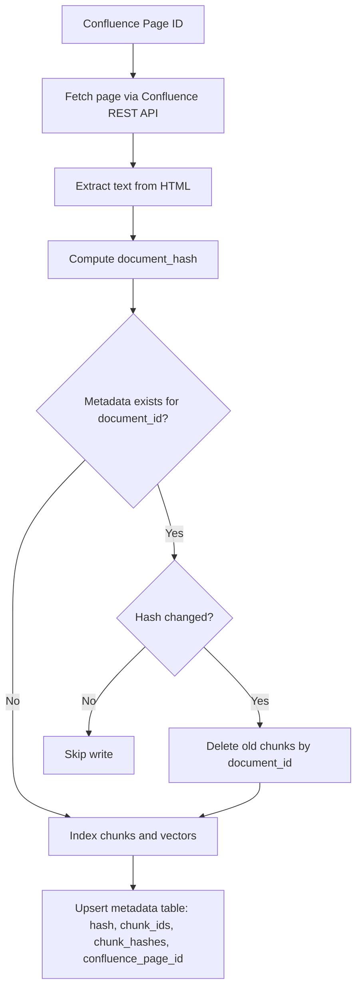
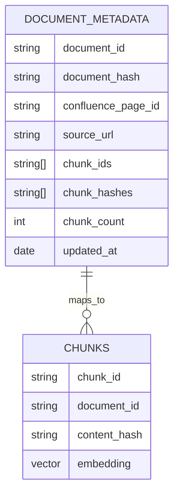
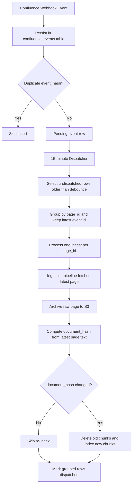
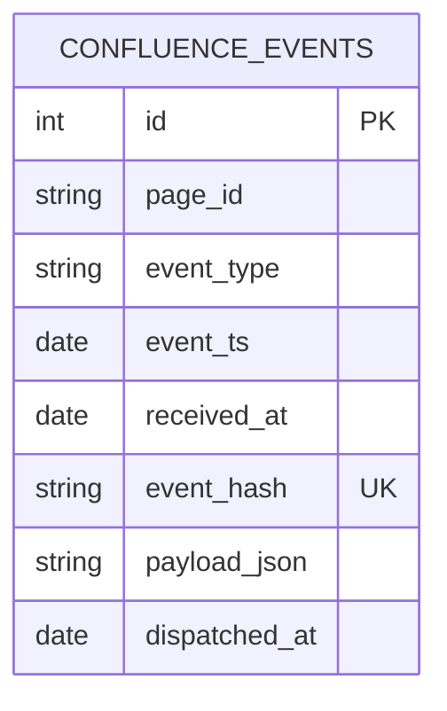

# Data Ingestion Microservice (RAG Pipeline)

This microservice:

1. Downloads a Confluence page by page ID
2. Extracts plain text from Confluence storage HTML
3. Performs semantic chunking using LangChain
4. Redacts PII/PHI using Microsoft Presidio
5. Hashes raw text using SHA-256 (one-way)
6. Generates embeddings using Cohere `embed-english-v2` via Bedrock
7. Indexes redacted chunks + vectors into OpenSearch

## Architecture

This microservice implements a complete RAG (Retrieval-Augmented Generation) data ingestion pipeline with a modular, production-ready architecture. Each component is designed to be independently testable and replaceable.

### Incremental Ingestion with Hash Metadata

The ingestion pipeline now supports deterministic incremental updates for the same `document_id`.

- A full-document hash (`document_hash`) is computed from extracted raw text.
- A metadata index stores the current hash and chunk map for each `document_id`.
- On re-ingest:
  - If hash matches existing metadata: skip re-index.
  - If hash differs: delete all old chunks for that document and write all new chunks + vectors.

Mermaid flow:



Metadata mapping:



### Production-safe Confluence Event Ingestion (15-minute dispatcher)

For large organizations, webhook spikes are expected. This service supports a durable event-store pattern with deterministic dedupe and a debounce window:

- Every webhook event is stored in a local SQLite event table (`confluence_events`).
- Exact retries are deduplicated by `event_hash`.
- A dispatcher runs every 15 minutes (configurable), groups by `page_id`, and ingests each page once.
- Workers remain idempotent via existing `document_hash` checks (no-op if content unchanged).

Mermaid flow:



Data model:



### Key Components

**Semantic Chunking**: Uses Cohere Bedrock embeddings (`embed-english-v2`) with LangChain's `SemanticChunker` to intelligently split documents into semantically meaningful chunks. The chunking process considers:
- Maximum chunk size (default: 1000 characters, configurable via `MAX_CHUNK_SIZE`)
- Minimum chunk size (default: 200 characters, configurable via `MIN_CHUNK_SIZE`)
- Breakpoint threshold type (`percentile`, `standard_deviation`, or `interquartile`)

**PII/PHI Redaction**: Leverages [Microsoft Presidio](https://microsoft.github.io/presidio/) with spaCy's `en_core_web_lg` model to detect and redact sensitive information. Presidio uses a combination of pattern matching, context analysis, and NLP-based detection methods to identify PII/PHI entities.

**Currently Detected Entities** (configurable in `src/pii/pii_presidio.py`):
- **Global Entities**: `PERSON`, `PHONE_NUMBER`, `EMAIL_ADDRESS`, `IP_ADDRESS`, `CREDIT_CARD`, `DATE_TIME`, `LOCATION`, `MEDICAL_LICENSE`
- **US-Specific**: `US_SSN` (Social Security Number)
- **Medical**: `HEALTH_INSURANCE_POLICY_NUMBER`


For a complete list of supported entities, see the [Presidio Supported Entities documentation](https://microsoft.github.io/presidio/supported_entities/).

**Detection Methods**: Presidio employs multiple detection strategies:
- Pattern matching with regex and validation (checksums, format validation)
- Context analysis using NLP models
- Custom logic for complex entities
- Integration with external services (Azure AI Language, Azure Health Data Services)

The service can be extended to detect additional entity types by modifying the `entities` list in the `PiiPresidioService` class.

**Embedding Generation**: Utilizes Cohere's `embed-english-v2` model through AWS Bedrock for high-quality vector representations. The embedder implements LangChain's `Embeddings` interface, making it compatible with the semantic chunker and other LangChain components.

**Vector Storage**: Indexes documents in OpenSearch with:
- KNN vector search capabilities (HNSW algorithm with cosine similarity)
- Metadata tracking (Confluence source, PII flags, content hashes)
- Support for semantic search queries

## Configuration

### Environment Variables

The service supports multiple environments (dev, staging, prod) through separate `.env` files:

**Core Configuration:**
- `ENVIRONMENT`: Current environment (dev/staging/prod)
- `AWS_REGION`: AWS region for Bedrock
- `CONFLUENCE_BASE_URL`: Confluence site base URL (e.g., `https://your-org.atlassian.net`)
- `CONFLUENCE_EMAIL`: Atlassian account email used for API auth
- `CONFLUENCE_API_TOKEN`: Atlassian API token used for API auth
- `CONFLUENCE_PAGE_ID`: Confluence page ID to ingest
- `OPENSEARCH_ENDPOINT`: OpenSearch cluster endpoint
- `OPENSEARCH_INDEX`: Target index name
- `BEDROCK_COHERE_MODEL`: Cohere model ID (default: `cohere.embed-english-v2`)
- `MAX_CHUNK_SIZE`: Maximum chunk size in characters (default: 1000)
- `MIN_CHUNK_SIZE`: Minimum chunk size in characters (default: 200)
- `BREAKPOINT_THRESHOLD_TYPE`: Chunking threshold type (default: `percentile`)
- `CONFLUENCE_EVENT_DB_PATH`: SQLite path for event store (default: `data/confluence_events.db`)
- `CONFLUENCE_WEBHOOK_HOST`: webhook server bind host (default: `0.0.0.0`)
- `CONFLUENCE_WEBHOOK_PORT`: webhook server bind port (default: `8081`)
- `CONFLUENCE_WEBHOOK_TOKEN`: optional shared token for webhook auth
- `RAW_ARCHIVE_S3_BUCKET`: S3 bucket for raw Confluence page archive (optional, recommended)
- `RAW_ARCHIVE_S3_PREFIX`: S3 prefix for raw archive objects (default: `confluence/raw`)
- `RAW_ARCHIVE_S3_SSE`: S3 server-side encryption mode (default: `AES256`)

**Metadata Fields (Required for Enterprise/Federal Deployments):**
- `DEPARTMENT`: Organizational department (required) - e.g., `Engineering`, `Finance`, `HR`
- `ROLES_ALLOWED`: Comma-separated list of allowed roles (required) - e.g., `developer,manager,analyst`
- `DOCUMENT_ID`: Unique document identifier (optional, auto-generated from Confluence page ID if not provided)

**Recommended Metadata Fields:**
- `DIVISION`: Sub-unit within department - e.g., `Platform`, `Infrastructure`, `Product`
- `TEAM`: Specific team - e.g., `DevOps`, `Security`, `API Team`
- `DOC_TYPE`: Document type - e.g., `confluence_page`, `policy`, `SOP`, `manual`
- `TAGS`: Comma-separated tags - e.g., `onboarding,api,authentication`

**Optional Metadata Fields:**
- `DOCUMENT_TITLE`: Human-readable document title
- `DOCUMENT_VERSION`: Document version
- `CLASSIFICATION`: Document classification - e.g., `internal`, `public`, `FOUO`
- `SECURITY_LEVEL`: Security level - e.g., `low`, `medium`, `high`
- `OWNER`: Document owner
- `DATA_DOMAIN`: Data domain - e.g., `HR`, `Finance`, `Tax`, `API`
- `SOURCE_URL`: Original source location
- `INGESTED_BY`: User/system that performed ingestion (defaults to `USER` env var)
- `EMBEDDING_MODEL_VERSION`: Version of embedding model
- `CHUNKER_VERSION`: Version of chunker

For complete metadata documentation, see [`METADATA.md`](METADATA.md).

### Running the Pipeline

```bash
# Set environment
export ENVIRONMENT=dev

# Run pipeline
python -m src.pipelines.ingestion_pipeline
```

### Running Event Store Workflow

```bash
# 1) Add an event (simulates webhook receiver behavior)
python -m admin.confluence_events add \
  --page-id 123456 \
  --event-type page_updated \
  --event-ts 2026-06-02T20:00:00Z

# 2) Dispatch deduped pages every 15 minutes (run from cron/scheduler)
python -m admin.confluence_events dispatch --interval-minutes 15 --max-pages 200
```

### Running a Confluence Webhook Receiver

```bash
# Start local webhook receiver (stores events into confluence_events table)
ENVIRONMENT=dev python -m admin.confluence_webhook_server
```

Endpoints:

- `GET /health` -> receiver health check
- `POST /webhooks/confluence` -> store one Confluence webhook payload

Optional auth:

- Set `CONFLUENCE_WEBHOOK_TOKEN` and send either:
  - `X-Webhook-Token: <token>`, or
  - `Authorization: Bearer <token>`

Sample webhook test:

```bash
curl -X POST "http://localhost:8081/webhooks/confluence" \
  -H "Content-Type: application/json" \
  -d '{
    "webhookEvent":"page_updated",
    "timestamp":"2026-06-02T20:00:00Z",
    "page":{"id":"123456"}
  }'
```

When `RAW_ARCHIVE_S3_BUCKET` is configured, each dispatched page ingestion archives the fetched raw record to S3 before hash comparison and indexing. This provides replay/audit support while still deduplicating execution by `page_id` every dispatch cycle.

Scheduler example:

```bash
# Every 15 minutes
*/15 * * * * cd /path/to/data-ingestion && ENVIRONMENT=prod python -m admin.confluence_events dispatch --interval-minutes 15 --max-pages 200
```

### Docker Deployment

```bash
# Build image
docker build -t data-ingestion:latest .

# Run container
docker run --env-file env/.env.dev data-ingestion:latest
```

## Testing

Run the test suite:

```bash
# Install dependencies
pip install -r requirements.txt

# Run all tests
pytest

# Run with coverage
pytest --cov=src --cov-report=html
```

## Features

Supports:
- dev / staging / prod `.env` environments  
- Docker-based deployment  
- Modular architecture  
- Full unit test suite (pytest)
- Configurable semantic chunking with Cohere Bedrock embeddings
- Comprehensive PII/PHI detection and redaction
- Content deduplication via SHA-256 hashing
- Production-ready logging and error handling

