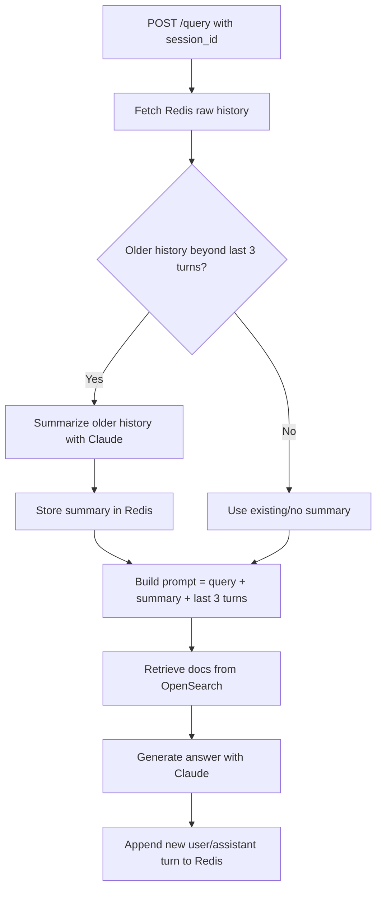

# RAG Query Service (FastAPI)

This service:

1. Accepts natural language questions via a FastAPI endpoint
2. Embeds the query using Cohere `embed-english-v3` via Amazon Bedrock
3. Retrieves top-k similar documents from OpenSearch (vector search)
4. Calls Anthropic Claude (via Bedrock) with retrieved context
5. Returns a grounded answer + source metadata

Environment-aware configuration:
- env/.env.dev
- env/.env.staging
- env/.env.prod

## Quick Start

```bash
# Install dependencies
pip install -r requirements.txt

# Set environment (optional, defaults to dev)
export ENVIRONMENT=dev

# Run FastAPI
uvicorn src.api.fastapi_app:app --reload
```

## Testing

```bash
# Run all tests
pytest

# Run with coverage
pytest --cov=src --cov-report=html
```

## API Usage

Test the query endpoint:

```bash
curl -X POST http://localhost:8000/query \
  -H "Content-Type: application/json" \
  -d '{"query": "What is in the dev documents?", "top_k": 3}'
```

Health check:

```bash
curl http://localhost:8000/health
```

## Chat Memory (Redis L2 Cache)

The API now supports optional Redis-backed chat memory for prompt augmentation:

- Set `REDIS_ENABLED=true` to enable.
- Store raw turn history per `session_id`.
- Prompt context uses:
  - last 3 turns (raw), and
  - summarized remainder of older history.

Request example:

```bash
curl -X POST http://localhost:8000/query \
  -H "Content-Type: application/json" \
  -d '{"query":"What did we decide earlier?","top_k":5,"session_id":"chat-123"}'
```

Mermaid flow:



Suggested env vars:

- `REDIS_ENABLED` (`true|false`)
- `REDIS_HOST`
- `REDIS_PORT`
- `REDIS_DB`
- `REDIS_PASSWORD`
- `REDIS_HISTORY_TTL_SECONDS`
- `CHAT_HISTORY_MAX_MESSAGES`
- `CHAT_HISTORY_KEEP_LAST` (default 3)

## Recommended Balanced Settings for RAG

These settings are used by enterprise RAG systems in Federal and banking institutions to ensure factual, deterministic, and safe responses:

| Parameter | Recommended | Why |
|-----------|-------------|-----|
| **temperature** | 0.0–0.1 | Strictly factual, deterministic outputs |
| **top-k** | 20–40 | Enough stability in token selection |
| **top-p** | 0.1–0.3 | Avoid hallucinations, stay anchored to context |

### Benefits

These settings keep the model:
- **Deterministic**: Consistent responses for the same input
- **Factual**: Grounded in retrieved context, not generating new information
- **Anchored**: Strictly adheres to provided documents
- **Safe**: Reduces risk of hallucination and off-topic responses

### Current Implementation

The service currently uses:
- `temperature: 0.1` (within recommended range)
- Additional parameters can be configured in `src/llm/claude_bedrock_client.py`

### Important Note: Claude on Amazon Bedrock API Limitations

**Claude on Amazon Bedrock does NOT always expose `top_k` + `top_p`**

Unlike OpenAI models or Cohere models, Anthropic Claude via Bedrock has a limited sampling API, especially in older versions:

**Some Claude models only allow:**
- `temperature`
- `max_tokens`
- `stop_sequences`

**And do NOT allow:**
- `top_k`
- `top_p`

This depends on the model version.

**For example:**
- ✔ Claude 3 Haiku
- ✔ Claude 3 Sonnet
- ✔ Claude 3 Opus

→ **Do NOT support `top_k` and `top_p` on Bedrock**  
→ **Only support `temperature` + `max_tokens`**

**Summary:** While we recommend `top_k` (20–40) and `top_p` (0.1–0.3) for optimal RAG performance, Claude models on Bedrock primarily rely on `temperature` (0.0–0.1) for controlling determinism and factuality. The current implementation uses `temperature: 0.1`, which achieves the desired factual, deterministic behavior within Bedrock's API constraints.


